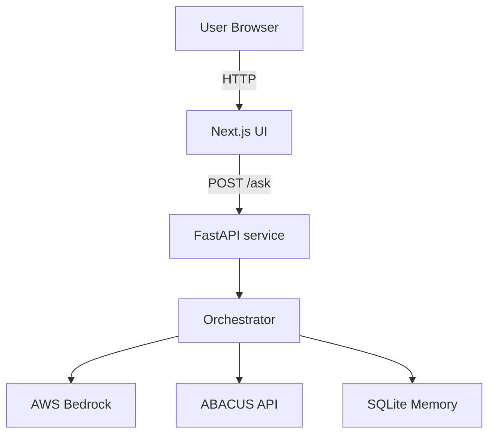

# ABACUS Technology Query UI

This project provides an end‑to‑end chat experience built with a Next.js
frontend and a FastAPI backend.  It is aimed at developers who need to explore
the Ameritas technology catalog via a conversational assistant.  The backend
coordinates calls to AWS Bedrock, the ABACUS API and a local SQLite store while
the frontend renders a responsive UI.

## Project structure

- `packages/frontend` – React application powered by Next.js
- `packages/backend` – FastAPI service that handles `/ask` requests

## Architecture



## Getting started

For a step‑by‑step installation guide see [INSTALL.md](INSTALL.md).

### Frontend

```bash
cd packages/frontend
pnpm install
pnpm dev
```

Open `http://localhost:3000` in your browser.

### Backend

```bash
cd packages/backend
python3 -m venv .venv  # optional
source .venv/bin/activate
pip install -r requirements.txt
python main.py
```

### Local build and run

To install dependencies, build the frontend, and start both services, run
`deploy_local.sh` on Linux or `deploy_local.bat` on Windows. The scripts
create a Python virtual environment in `packages/backend/.venv` if needed:

```bash
./deploy_local.sh
```

The scripts launch the backend on port `8000` and the frontend on
`http://localhost:3000`.

### Docker Compose

You can also run the application using Docker Compose:

```bash
docker-compose up --build
```

The compose file defines a named volume `memory-data` that stores the
SQLite database used for long-term memory at `/app/memory` inside the
backend container. The volume preserves conversation history across
container restarts.

## Configuration

Copy `.env.example` to `.env` and provide values for the following settings:

- `BEDROCK_API_BASE` and `BEDROCK_API_KEY`
- `BEDROCK_MODEL_ID`
- `ABACUS_BASE_URL` and `ABACUS_CLIENT_SECRET`
- `VERIFY_SSL` (use `false` to allow self-signed certificates)
- `NEXT_PUBLIC_API_URL` – URL of the backend for the frontend to call
- Optional: `APP_NAME`, `APP_LOGO`, `ALLOWED_ORIGINS`, and `LONG_TERM_PATH`

## Features

- Suggested prompts loaded from `public/prompts.json`
- FAQ page at `/faq`
- UI components from the Shadcn library without using the CLI
- Agentic orchestration with supervisor, worker, and reviewer roles
- Basic short-term and long-term memory for conversations

### Migration notes

Long-term memory is now stored in an SQLite database located at
`packages/backend/memory/long_term.db` by default. Previous versions used a
`long_term.json` file. The service will create the new database automatically.
To use a custom location, set the `LONG_TERM_PATH` environment variable.
